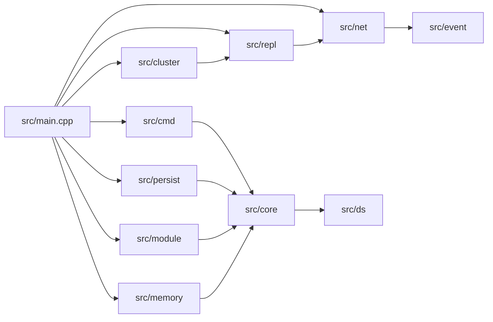

# Architecture

Nexor is organized as a small set of layers around the main server entrypoint.

## Layers

- `core` and `ds`: shared utilities and data structures
- `event` and `net`: event loop and networking
- `cmd`: command parsing and replies
- `persist` and `repl`: storage and replication
- `cluster`, `module`, `memory`: distributed, extensibility, and runtime support